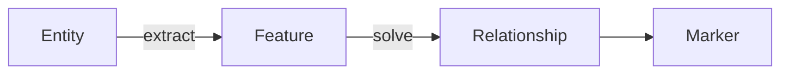
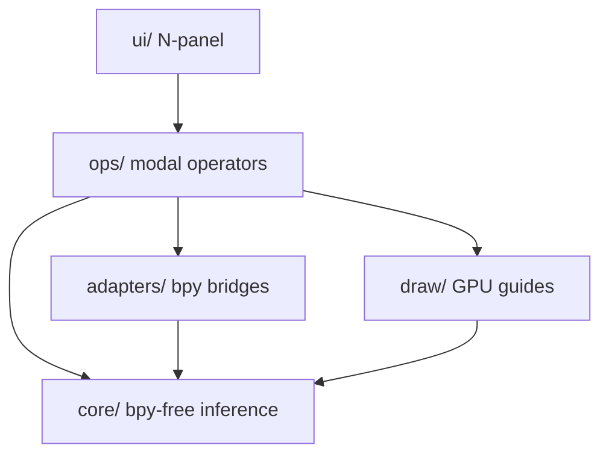

# Architecture

Magnets is a Blender add-on for geometric relationship snapping in the 3D
Viewport. Inference logic under `core/` has no `bpy` dependency and uses
`mathutils` and `numpy` only.

## Transform Paths

- **Default, snap on release** (`transform_overlay.py`): a `bpy.app.timers`
  loop watches Blender's native `TRANSFORM_OT_*` operators. During the drag it
  only draws guides and a landing ring. When the transform is released it
  re-runs inference once, applies the snap, and folds it into the transform's
  undo step. It stands aside when Blender's own snapping is active.
- **Precision Mode** (`ops/modal_*.py`): opt-in keymap items bind `G`/`R`/`S`
  to Magnets' modal operators, which own the transform and lock onto guides
  while dragging.

## Caching and Per-Tick Cost

- **Across drags** (`adapters/scene_cache.py`): mesh features are reused
  while an object's `matrix_world` and `bound_box` are unchanged. Surface
  BVHs are built lazily, in object-local space, only for meshes a tangency
  query reaches. A depsgraph handler drops a BVH when its object's geometry
  changes; undo, redo and file load clear everything.
- **Within a drag** (`adapters/bmesh_extract.EditSelection`): Edit Mode
  captures the selection once per drag, so each tick touches only the
  selected elements. Selections over `DETAIL_LIMIT` (2048) vertices are
  summarised by their bounding box, with the centroid tracked from a fixed
  sample.

## Data Pipeline

Each inference tick (a timer frame or a modal `MOUSEMOVE`) runs:

1. **Extraction**: Scene elements (`Entity`) become geometric primitives (`Feature`).
2. **Dispatch**: Feature pairs go to solvers by type.
3. **Solving**: Solvers emit `Relationship` values with a `ConstraintDelta` and `Guide`.
4. **Ranking**: Candidates are scored (screen distance, residual, family weight); slot suppression removes duplicates.
5. **Resolution**: Top constraints become a transform offset applied to preview/commit state.

## Data Models

Core pipeline state uses typed dataclasses:

- `Entity`: Participant in inference (object, vertex, edge, etc.).
- `Feature`: Primitive (`PointFeature`, `LineFeature`, `PlaneFeature`, `DirectionFeature`, `CircleFeature`, `BBoxFeature`).
- `Relationship`: Solver output: targets, residual, `ConstraintDelta`, and `Guide`.
- `SolveContext`: Tolerances, axes, transform mode, and related constants.

## Package Layout

- `core/features.py`: Feature dataclasses.
- `core/relationship.py`: `Relationship` and `ConstraintDelta`.
- `core/solvers/`: Solvers implementing the `Solver` ABC.
- `core/resolver.py`: Merge constraints into translation / rotation / scale.
- `core/spatial.py`: KDTree and hash-grid broad phase.
- `adapters/`: Map `bpy` types to `Entity` / `Feature`.
- `ops/`: Modal operators and the shared inference pipeline.
- `draw/`: GPU guide rendering.
